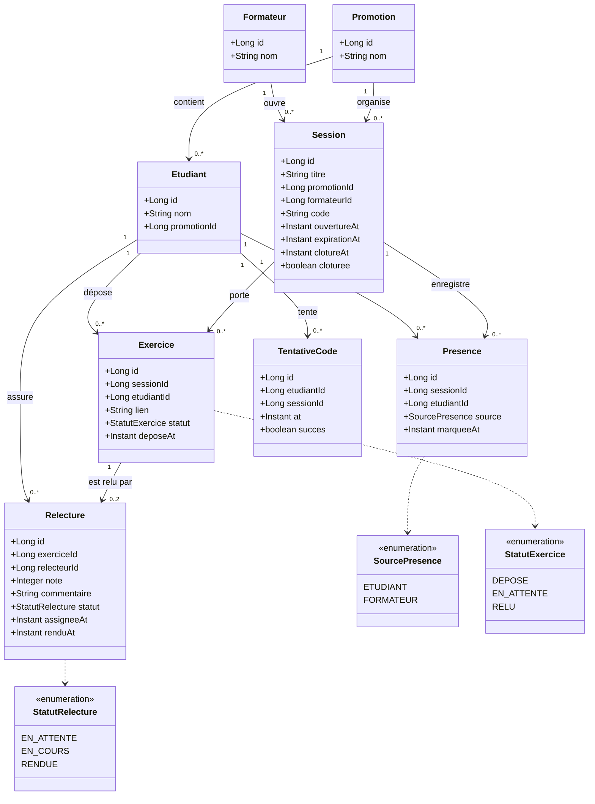

# D2 — Diagramme de classes / modèle de données

**Source :** `docs/CAHIER_DES_CHARGES.md` — sections 2 (relecteur = état d'un étudiant) et 6 (règles de gestion).
**Contrainte :** doit rester cohérent avec les migrations Flyway `V1__init.sql` et suivantes (B5).

```mermaid
classDiagram
    class Promotion {
        +Long id
        +String nom
    }

    class Etudiant {
        +Long id
        +String nom
        +Long promotionId
    }

    class Formateur {
        +Long id
        +String nom
    }

    class Session {
        +Long id
        +String titre
        +Long promotionId
        +Long formateurId
        +String code
        +Instant ouvertureAt
        +Instant expirationAt
        +Instant clotureAt
        +boolean cloturee
    }

    class Presence {
        +Long id
        +Long sessionId
        +Long etudiantId
        +SourcePresence source
        +Instant marqueeAt
    }

    class Exercice {
        +Long id
        +Long sessionId
        +Long etudiantId
        +String lien
        +StatutExercice statut
        +Instant deposeAt
    }

    class Relecture {
        +Long id
        +Long exerciceId
        +Long relecteurId
        +Integer note
        +String commentaire
        +StatutRelecture statut
        +Instant assigneeAt
        +Instant renduAt
    }

    class TentativeCode {
        +Long id
        +Long etudiantId
        +Long sessionId
        +Instant at
        +boolean succes
    }

    class SourcePresence {
        <<enumeration>>
        ETUDIANT
        FORMATEUR
    }

    class StatutExercice {
        <<enumeration>>
        DEPOSE
        EN_ATTENTE
        RELU
    }

    class StatutRelecture {
        <<enumeration>>
        EN_ATTENTE
        EN_COURS
        RENDUE
    }

    Promotion "1" --> "0..*" Etudiant : contient
    Promotion "1" --> "0..*" Session : organise
    Formateur "1" --> "0..*" Session : ouvre

    Session "1" --> "0..*" Presence : enregistre
    Etudiant "1" --> "0..*" Presence : marque

    Session "1" --> "0..*" Exercice : porte
    Etudiant "1" --> "0..*" Exercice : dépose

    Exercice "1" --> "0..2" Relecture : est relu par
    Etudiant "1" --> "0..*" Relecture : assure

    Etudiant "1" --> "0..*" TentativeCode : tente

    Presence ..> SourcePresence
    Exercice ..> StatutExercice
    Relecture ..> StatutRelecture
```

## Règles de cardinalité portées par le modèle

| Relation                                    | Cardinalité                       | Règle                         |
| ------------------------------------------- | --------------------------------- | ----------------------------- |
| Etudiant ↔ Presence                         | 1..\* mais **unique par session** | RG13                          |
| Etudiant ↔ Exercice                         | 1..\* mais **unique par session** | RG14                          |
| Exercice ↔ Relecture                        | **0..2**                          | RG4 révisée (évolution étape 3, cf. section 7) + EF8 conditionnelle |
| Relecture.relecteurId ≠ Exercice.etudiantId | contrainte applicative            | RG2 (Q5)                      |
| Relecture.relecteurId (au sein d'un même exercice) | **distincts entre eux** | RG5 révisée (évolution étape 3) |

> **Évolution étape 3 (enveloppe, changement de besoin) :** la contrainte d'unicité `relecture.exercice_id` (1 relecteur par exercice, `V1__init.sql`) est remplacée par une unicité du couple `(exercice_id, relecteur_id)` dans `V3__deux_relecteurs.sql` — deux relectures par exercice au maximum, jamais deux fois le même relecteur. Migration additive, `V1`/`V2` non modifiées (C2).
